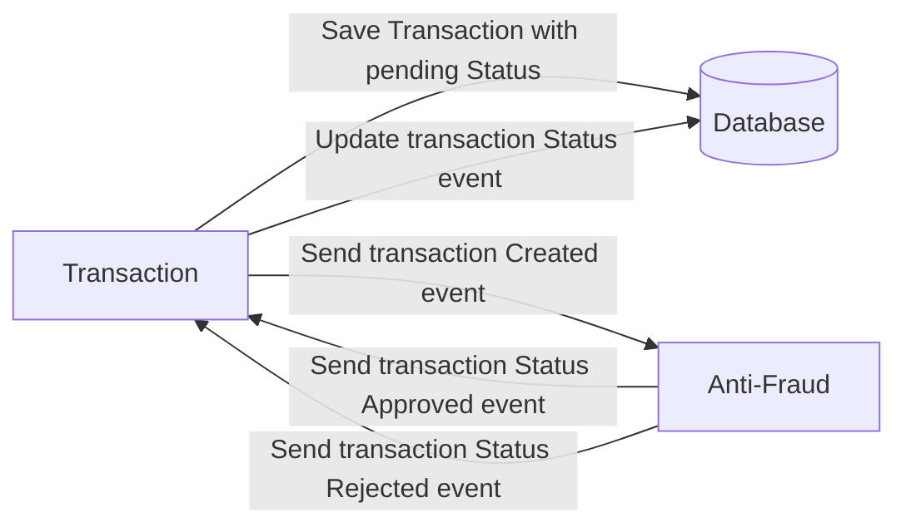

# Yape Code Challenge :rocket:

Our code challenge will let you marvel us with your Jedi coding skills :smile:. 

Don't forget that the proper way to submit your work is to fork the repo and create a PR :wink: ... have fun !!

- [Problem](#problem)
- [Tech Stack](#tech_stack)
- [Send us your challenge](#send_us_your_challenge)

# Problem

Every time a financial transaction is created it must be validated by our anti-fraud microservice and then the same service sends a message back to update the transaction status.
For now, we have only three transaction statuses:

<ol>
  <li>pending</li>
  <li>approved</li>
  <li>rejected</li>  
</ol>

Every transaction with a value greater than 1000 should be rejected.



# Tech Stack

<ol>
  <li>Node. You can use any framework you want (i.e. Nestjs with an ORM like TypeOrm or Prisma) </li>
  <li>Any database</li>
  <li>Kafka</li>    
</ol>

We do provide a `Dockerfile` to help you get started with a dev environment.

You must have two resources:

1. Resource to create a transaction that must containt:

```json
{
  "accountExternalIdDebit": "Guid",
  "accountExternalIdCredit": "Guid",
  "tranferTypeId": 1,
  "value": 120
}
```

2. Resource to retrieve a transaction

```json
{
  "transactionExternalId": "Guid",
  "transactionType": {
    "name": ""
  },
  "transactionStatus": {
    "name": ""
  },
  "value": 120,
  "createdAt": "Date"
}
```

## Optional

You can use any approach to store transaction data but you should consider that we may deal with high volume scenarios where we have a huge amount of writes and reads for the same data at the same time. How would you tackle this requirement?

You can use Graphql;

# Send us your challenge

When you finish your challenge, after forking a repository, you **must** open a pull request to our repository. There are no limitations to the implementation, you can follow the programming paradigm, modularization, and style that you feel is the most appropriate solution.

If you have any questions, please let us know.

# API Documentation


This project implements two microservices: Antifraud Service and Transaction Service, designed to validate financial transactions and manage their status through Kafka events. It includes monitoring with Prometheus and Grafana, as well as unit tests to ensure code quality.

## Technologies Used

- **Node.js** – JavaScript runtime environment for building scalable and fast applications.
- **NestJS** – A progressive Node.js framework for building efficient, reliable, and scalable server-side applications.
- **Prisma** – ORM (Object Relational Mapper) for database management and querying.
- **Redis** – In-memory key-value store used for caching.
- **Docker** – Platform for developing, shipping, and running applications in containers.
- **Prometheus** – Monitoring and alerting toolkit for collecting and querying metrics.
- **Grafana** – Visualization and analytics platform for monitoring metrics and logs.
- **PostgreSQL** – Relational database used to store application data, including a `FailedEvent` table for auditing failed Kafka message deliveries.

---

### **FailedEvent Table**

As part of the implementation, a `FailedEvent` table was added to the PostgreSQL database. This table is used to store audit data for messages that fail to be sent to Kafka after multiple retries. The table schema includes the following fields:

- **id**: Auto-incremented primary key.
- **transactionId**: The ID of the transaction associated with the failed message.
- **error**: The error message describing why the message failed.
- **timestamp**: The date and time when the failure occurred.

This ensures that failed messages are logged for further analysis or reprocesamiento.

---

### Prerequisites

Ensure you have the following installed:

- [Node.js](https://nodejs.org/)
- [Docker](https://www.docker.com/)
- [Redis](https://www.memurai.com/get-memurai)

---

### Steps to Install and Run

## Ejecución del Proyecto

1. **Clona el repositorio**:
   ```bash
   git clone https://github.com/lucasvalentian/app-nodejs-codechallenge.git
   cd yape-codechallenge

   docker-compose up --build
   ```

## API Endpoints

### Crear una Transacción
```bash
curl --location 'http://localhost:3000/transaction' \
--header 'Content-Type: application/json' \
--data '{
  "accountExternalIdDebit": "a1f4e567-b8f4-4d72-b3de-97b8e6d33a8d",
  "accountExternalIdCredit": "d1b5f423-458b-4b2d-a6f0-16e8c999a57d",
  "tranferTypeId": 1,
  "value": 2000
}'
```

### Get Transaction by ID

```bash
curl --location 'http://localhost:3000/transaction?transactionId=a1f4e567-b8f4-4d72-b3de-97b8e6d33a8d' \
--header 'Content-Type: application/json'
```

```json
{
  "code": 200,
  "message": "OK",
  "data": [
      {
          "transactionExternalId": "d6208b72-0a3f-4bf9-aaf3-b7e8758387b2",
          "transactionType": {
              "name": "TRANSFER"
          },
          "transactionStatus": {
              "name": "REJECTED"
          },
          "value": 2000,
          "createdAt": "2025-03-15T00:32:20.426Z"
      }
  ]
}
```

## Access

- **Transaction service Swagger**: [http://localhost:3000/api/docs](http://localhost:3000/api/docs) - Interactive API documentation for the transaction service.
- **Kafka UI**: [http://localhost:8080](http://localhost:8080) - Graphical interface to monitor Kafka topics and messages.
- **Prometheus**: [http://localhost:9090](http://localhost:9090) - Tool for monitoring system metrics.
- **Grafana**: [http://localhost:3001](http://localhost:3001) - Platform for visualizing metrics and logs.
  - **User**: admin
  - **Password**: admin

## Pruebas Unitarias

Para ejecutar las pruebas unitarias de ambos microservicios, sigue estos pasos:

1. **Antifraud Service**:
   - Navega a la carpeta del microservicio `antifraud-service`:
     ```bash
     cd antifraud-service
     ```
   - Ejecuta las pruebas unitarias:
     ```bash
     npm run test
     ```

2. **Transaction Service**:
   - Navega a la carpeta del microservicio [transaction-service](http://_vscodecontentref_/2):
     ```bash
     cd transaction-service
     ```
   - Ejecuta las pruebas unitarias:
     ```bash
     npm run test
     ```

### **Notas**:
- Asegúrate de que todas las dependencias estén instaladas antes de ejecutar las pruebas:
  ```bash
  npm install
  ```

---

## Exposed Metrics

- **Antifraud Service**:
  - `antifraud_kafka_messages_sent_total`: Total number of messages successfully sent to Kafka.
  - `antifraud_kafka_messages_failed_total`: Total number of messages that failed to send to Kafka.
  - `antifraud_transactions_validated_total`: Total number of validated transactions.
  - `antifraud_transactions_validation_errors_total`: Total number of errors during transaction validation.

- **Transaction Service**:
  - `transactions_created_total`: Total number of successfully created transactions.
  - `transactions_creation_errors_total`: Total number of errors while attempting to create transactions.
  - `transactions_retrieved_total`: Total number of retrieved transactions.

---


